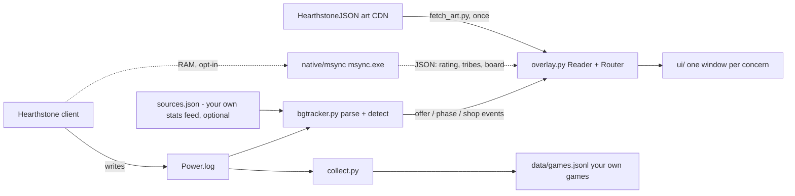

# Architecture

The design constraint everything follows from: **read-only, log-first**.
The tool never injects, hooks, or automates the game. Everything that can be
known from Hearthstone's own `Power.log` ships as the default; the one thing
that can't (the lobby's tribe list and your board) comes from an *optional*,
separately built memory reader that the overlay degrades gracefully without.

## Modules

| file | job |
|---|---|
| `bgtracker.py` | Everything headless: stats tables, log following/rotation, the `OfferDetector`, lobby/tribe tracking, phase detection, console rendering. Runnable alone as the console version. |
| `overlay.py` | The launcher only: the log Reader that turns Power.log into events, the Router that hands each event to the windows that declared it, and the Tk loop. No drawing. Imports `bgtracker` for all parsing. |
| `ui/` | One frameless window per concern (eleven of them, table below; OTHER PLAYERS only ever opens with the memory reader), plus `ui/base.py` (anchoring, per-window saved position, rounded drawing, click-through badge strips). `ui/__init__.py` holds the window registry, the plugin contract and the event table. `ui/settings.py` is the one window built the opposite way: a normal, clickable, focusable panel. |
| `settings.py` | The saved settings (`settings.json`) and the precedence rule: an explicit flag beats the file beats the built-in default, and a flag is never written back. |
| `sim/` | Combat odds, log-only: `boards.py` pulls both warbands out of Power.log before the first attack, `engine.py` is the Monte Carlo simulator, `validate.py` scores its predictions against every logged fight. BETA — see ROADMAP. |
| `collect.py` | Own-data collector: mines finished games (hero, placement, tribes) from the whole log history into `data/games.jsonl`. |
| `fetch_art.py` | One-shot card art download (tiles + crops) from HearthstoneJSON. |
| `native/msync/` | Optional C# helper (`msync.exe`): a clean-room reader for lobby tribes, player rating, and your board out of game memory, walking the public Mono/Unity heap layout. `dotnet build native/msync -c Release`; **not** bundled. See its own README. |
| `tests/` | Offline regression (CI) + live-path test, with a real-day fixture log. |

## The parser (bgtracker.py)

`Power.log` is a firehose of entity updates. The parts that matter:

**Offers.** When the game offers heroes or trinkets, each option appears as a
`FULL_ENTITY - Updating [entityName=... zone=... zonePos=... cardId=... player=...]`
line — the display name is already in the log, so no card database is needed.
The rules that make detection exact, each paid for with a real bug:

- **All options in one offer share a single log timestamp** — that's what
  groups a burst into one event. Any later-stamped line closes the group
  (waiting for the *next* offer would emit minutes late).
- **Heroes are dealt into `zone=HAND`** under your player id — which is also
  how the tool learns *which* player id is you.
- **Trinkets sit in `zone=SETASIDE`, which is full of noise**: every opponent's
  trinkets are staged there under YOUR player id as you fight them, again on
  every re-fight. Naive detection fires ~7× per game instead of 2. The
  discriminator: **a real trinket offer is always exactly 4 options.** Across
  19 real games: 36 clean bursts of four vs 65 twos, 43 ones, 18 threes, 15
  sixes of pure noise.
- **`zonePos` is provisional.** The client shuffles offered heroes into their
  final on-screen order *after* the burst, via `TAG_CHANGE ZONE_POSITION`
  lines that share the burst's timestamp. Corrections are applied to the
  pending buffer, and after emit a refresh is only accepted when the positions
  form a clean 1..N permutation (zeros/collisions are transit states).
- **Entity ids restart every game**, so all per-game dedupe resets on the next
  hero draft — and the "new game" flag is raised when the draft is *detected*,
  not when its group is emitted minutes later.

**Phase.** `TAG_CHANGE ... tag=BACON_CURRENT_COMBAT_PLAYER_ID value=N`:
N > 0 means combat, **value=0 means the fight ended — recruit**. It alternates
constantly; treating every occurrence as "combat" pins the UI on COMBAT.

**Shop.** A burst of minions in `zone=PLAY` *during recruit* is the tavern.
Player ids cannot discriminate shop from board (measured: one id owned every
minion in a game, shop and combat alike), and the `TB_BaconShop_DragBuy`
tokens only escort each turn's *first* roll (refreshes reuse them), so the
phase gate is the reliable rule. A **buy** is the tag change
`zone=PLAY ... tag=ZONE value=HAND` — not a `FULL_ENTITY` line.

**Tribes from the log.** Every minion line carries `tag=CARDRACE value=...`.
Seeing a tribe proves it's in this lobby; an unseen tribe is only ever
"not seen yet" — the log alone can never prove exclusion. In a measured real
game, 6 of 7 tribes were confirmed by ~turn 5, the last one 27 minutes later.
That gap is what the memory reader closes.

**Choices (discover / dark gift / trinket pick).** The
`GameState.DebugPrintEntityChoices()` block carries the exact options in
screen order — but it's logged *during the combat that precedes the pick*, so
it's buffered and delivered on the combat→recruit flip. The overlay takes
trinket *order* only from this reader (the offer burst logs all four trinkets
at `zonePos=0`).

## Stats

Tables are plain dicts keyed by cardId, loaded from whatever source **you**
configure in `sources.json` — a URL (cached in `.cache/` for an hour, requested
with a `bgtracker/<version>` User-Agent) or a local JSON file. The repo ships
**no data and no default source**: aggregate placement data belongs to whoever
collected it, and none of it is bundled or pointed at. Without a source every
table is empty and the UI shows offers without numbers. Offer *recognition*
never depends on stats — the hero/trinket ID sets come from HearthstoneJSON
(`bg_ids()`), so detection works data-free. `collect.py` exists so the
community can eventually stand on its own games instead.

Scoring notes that took real digging:

- **Lobby-tuned hero scores** use the standard lobby-scoring arithmetic:
  `averagePosition + Σ impactAveragePosition` over the tribes present, dropping
  tribe rows with too little data on either side (`dataPoints > total/20`, same for the
  missing-tribe counts).
- **Minion stars use the differential** `averagePlacement −
  averagePlacementOther`, binned per tavern tier, top-heavy bands. Raw
  averages measure *who buys a card* (late-game cards are bought by winners),
  not whether it helps — they once rated an entire shop 5★.
- **Right after a patch, `past-seven` is poison**: dead-meta comps keep frozen
  good averages on shrinking samples. Default everywhere is `last-patch`, and
  comps are floored at n ≥ 300 so zombie archetypes drop out.

## The overlay (overlay.py + ui/)

**One window per concern, each with its own lifecycle.** There is no shared
mode and no mode enum anywhere: every surface is its own frameless window that
opens and closes on its own trigger. The single morphing panel that came before
produced every live bug of its era — odds a fight late, a stale tavern, a
COMBAT header sitting over the shop — because one state machine was trying to
be several surfaces at once. `overlay.py` is now only Reader → Router → Tk
loop; `ui/__init__.py` documents the contract, the events and the layout.

| window | file | shows | opens on | closes on |
|---|---|---|---|---|
| COUNTERS | `counters.py` | turn, gold `cur/max`, tavern tier, the live next-tier price, gold banked for next turn, elemental/Blood Gem buffs, board tribe counts, free rerolls, triples, trinket countdown | any counter being known | `game` |
| COMBAT | `combat.py` | the round fighting + the BETA win/tie/loss line | `combat` | `combat_over` |
| TAVERN | `tavern.py` | the shop with per-tier stars, comp flags, gold | `tavern` (every rebuild) | `tavern_gone` |
| bgtracker | `comps.py` | lobby tribes, the comps still open, board synergy; owns the quit button | always up | never |
| MINIONS | `browser.py` | the whole live minion pool, filtered by tier/tribe/mechanic | always up (slim bar; expands on click) | collapses on `game` |
| SESSION | `session.py` | MMR now vs session start, finished games with placements, lobby tribes | always up | stands aside for the draft |
| PICK YOUR HERO | `heropick.py` | the ranked draft + badges on the portraits | `hero` | `hero_over`, 75s |
| PICK YOUR HERO POWER | `heropower.py` | the hero powers on offer | `heropower` | `picks_over`, next `tavern`, 45s |
| PICK YOUR TRINKET | `trinkets.py` | the ranked trinkets + badges on the cards | `trinket` | `picks_over`, next `tavern`, 45s |
| PICK ONE | `discover.py` | discovers and Dark Gifts, rated per option | `discover` | `picks_over`, next `tavern`, 25s |
| OTHER PLAYERS | `players.py` | the leaderboard, and each opponent's last-seen board with the round it was seen | `players` (memory reader only) | `game`; stands aside for a trinket offer |

Layout is geometry, not runtime logic: each window claims a fixed band down one
edge of the game window (right = the state of play, left = the cards you are
choosing between, because a right-hand panel would sit on the trinket row,
which reaches x 0.79). Every window's height is capped to its own band, so a
long shop or an expanded comp list can never spill onto a neighbour. Three bands
are shared, and only ever by one window at a time: SESSION steps aside for the
hero draft (and stops doing so once you drag it elsewhere), OTHER PLAYERS does
the same for a trinket offer, and MINIONS is a one-line bar until you
deliberately expand it.

- **The COUNTERS strip reads the log itself.** Its numbers are tags the game
  writes about you, so it tails Power.log on its own thread rather than routing
  them through the reader — which is also how it fills in when the overlay is
  started mid-game (a bounded backfill that starts at the last
  `PlayerID=n, PlayerName=x`, the top of the game you are in). If a reader ever
  pushes a `counters` event, that wins and the window drops its own feed: two
  sources for one number is the bug the whole package exists to prevent. Every
  value comes from the PowerTaskList copy, and everything written during a
  fight is held until the shop is back — inside one real fight our own tier
  read 4 → 0 → 6 → 4 as the client mirrored the opponent onto our entity.

- **The screen is the truth.** Power.log writes everything twice:
  `GameState.DebugPrintPower()` writes an entire fight (and often the next
  shop) seconds ahead, `PowerTaskList.DebugPrintPower()` replays it in sync
  with the animation. GameState is read for *data* — the shop's contents, both
  warbands — but every show/hide/clear keys off PowerTaskList.
- **A fight that never ends.** Measured on two real logs, 4 of 69 and 6 of 82
  fights write their combat-start tag but never the `value=0` that ends it.
  Following the tag alone leaves the overlay stuck in combat for the whole
  next recruit phase. The recovery: a tavern refresh belonging to *our* player
  in the PowerTaskList copy can only happen with the shop on screen, so it
  ends the fight. It proved specific — it fired on 4 of 930 refreshes, i.e.
  only inside the broken fights.
- **Rebuilt on every roll.** A refresh re-uses the existing `DragBuy` tokens
  and creates rerolled minions in SETASIDE, so *no line ever says "this minion
  entered the shop"*. The shop is instead sampled from tracked entity state —
  what sits in PLAY under Bob's controller — and any change (roll, buy, sell,
  tavern spell) rebuilds the window. One refresh fires a Refresh trigger block
  per slot it replaces (136 blocks for 36 refreshes), so counting blocks
  counts wrong; the refresh *moment* is the timestamp.
- **Anchored to the game**: `FindWindowW("UnityWndClass", "Hearthstone")` +
  `GetWindowRect`, re-checked on a poll; each window has its own default band
  down the left or right edge (capped so they can never overlap) and its own
  drag offset under its own key in `.overlay.json`. Windows exist only while
  Hearthstone (or one of them) is foreground.
- **Click-through** via `WS_EX_TRANSPARENT` so clicks reach the game — which
  is also why badges aren't draggable yet (see ROADMAP). The style is
  re-asserted every time a badge strip is shown, *after* the deiconify: until a
  strip has been mapped, `GetParent` answers 0 and the style lands on the child
  instead of the wrapper Windows hit-tests (measured: `0x80088` when it is set
  before the deiconify, `0x80800A8` after it).
- Tkinter traps that cost real time: `overrideredirect(True)` must be set
  *before* building widgets (else the window balloons to fullscreen), and
  64-bit `Get/SetWindowLongPtrW` need explicit `argtypes` or click-through
  silently no-ops. A stderr log + heartbeat exist because a KeyError inside a
  Tk callback once killed the redraw chain with the window still "visible".

## The settings panel (settings.py + ui/settings.py)

The panel is the one window in `ui/` that is the opposite of an overlay
surface, and every difference is deliberate: a plain `Toplevel` with the
system's own title bar (no `overrideredirect`), **no** `-transparentcolor`
(the key colour is a hole, and a hole cannot be clicked), **no**
`WS_EX_TRANSPARENT` (nothing calls `clickthrough()` on it), and `-topmost`
**yes** - the game is borderless fullscreen, so a panel that is merely focused
opens behind it (screenshotted against a running client). Topmost is z-order
only and has nothing to do with hit testing. Its window handle goes into
`WindowManager.extra_hwnds`, the focus allow-set, so giving the panel focus is
not read as the game losing focus: without that the overlay would withdraw
exactly while you drag the scale slider, which is the one moment you need to
watch it.

What is live and what is not, because a settings panel that quietly needs a
restart is worse than one that says so:

| setting | when it takes effect |
|---|---|
| UI scale, badge nudge | as you drag |
| every window on or off | immediately, built or destroyed |
| the data opt-in, the update settings | immediately |
| MMR bracket, period, Duos, which feed | next start, and the row says so |

The four that wait are the tables the log reader loads once, at startup.
Reloading them under a running game would re-score an offer that is already on
screen from a different table.

Storage is split so nothing owns the same value twice: `settings.json` (this
panel), `data/update.json` (`update.py`), `sources.json` (the feeds),
`.overlay.json` (where each window was dragged). The WHAT TO SHOW list is
generated from `ui.WINDOWS`, and each line's description is the first sentence
of that window module's own docstring, so a window added later cannot be
forgotten here. Switched off means **not built**: hiding it would leave it
consuming its events and holding a badge strip whose priority can suppress
another window's badges.

## The memory reader (native/msync)

The tribe list and your board are the two things Hearthstone never writes to
any log (verified by checking every tag before hero select). `msync.exe` reads
them by walking the standard Mono/Unity managed heap — process → mono domain →
`Assembly-CSharp` image → class cache → `GameState.s_instance`, then the tribes,
`m_playerMap`/`m_entityMap`, and the NetCache rating off it. It prints one JSON
line (`{"ok":true,"rating":...,"races":[...],"board":[...]}`) per poll. The
overlay spawns it, falls back to log inference without it, and kills it on exit
(orphaned helpers lock the binary against rebuilds). It is **opt-in by build** —
see the README's Safety section for why it isn't bundled, and
`native/msync/README.md` for how it works.

Fragility profile: balance and content patches are invisible (fields resolve by
name); a Unity *engine* upgrade moves the struct offsets (a few times a year),
and the fix is re-deriving the values in `Offsets.cs` from the public Mono
headers each is annotated with — `DumpFields` in `Mono.cs` is the diagnostic aid.

## Testing philosophy

**Count against reality, not against a slice.** The regression fixture is one
whole real day (19 games), and the test demands the exact real-world totals:
19 hero offers, 36 trinket offers. The two subtlest bugs so far (opponent
trinket noise, entity re-statements) both passed slice tests and were only
caught by whole-day counts sanity-checked against how Battlegrounds actually
works. CI runs this offline — frozen cardId lists stand in for the live
tables, so the suite needs no network and can't drift with the meta.
